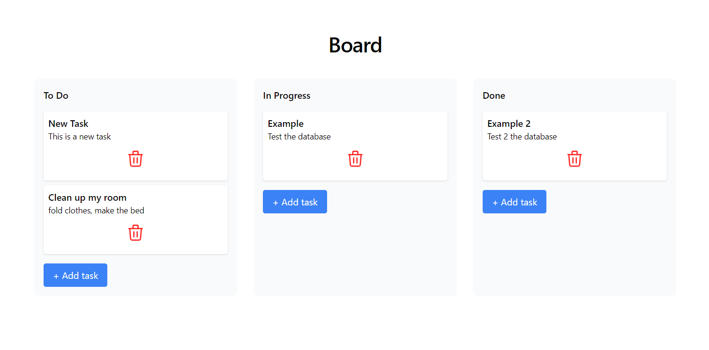
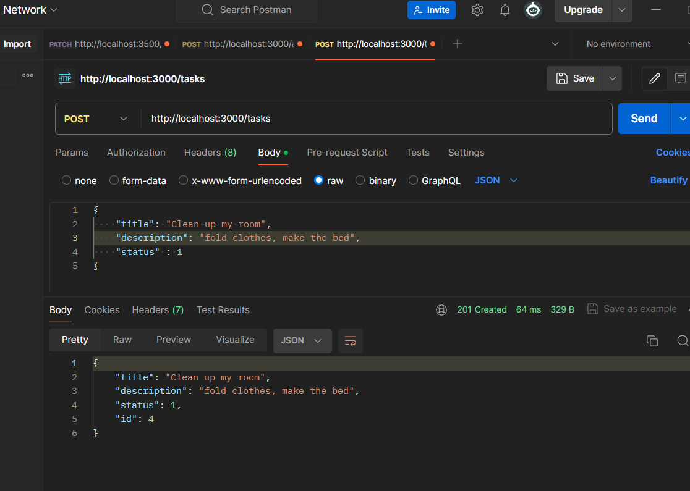

# Task Manager App

## Descripción

Este proyecto es una App de gestión de tareas desarrollada con NestJS y PostgreSQL en su parte backend. La API permite realizar operaciones CRUD sobre las tareas, cada una de las cuales tiene un estado asociado. Con las tecnologías de Astro y TailwindCSS para la parte del frontend.

## Contenidos

- [Requisitos](#requisitos)
- [Instalación](#instalación)
- [Configuración](#configuración)
- [Uso](#uso)
- [Endpoints](#endpoints)
- [Resultados](#resultados)


## Requisitos

- Node.js (v14 o superior)
- pnpm 
- PostgreSQL

## Instalación

Sigue estos pasos para instalar y ejecutar el proyecto en tu máquina local.

1. Clona el repositorio:

    ```bash
    git clone https://github.com/CamiloM123/ToDo.git
    ```

2. Navega al directorio del proyecto e instala las dependencias para el backend:

    ```bash
    cd section-3
    cd task-manager
    pnpm install
    ```

3. Navega al directorio del proyecto e instala las dependencias para el frontend:

    ```bash
    cd section-2
    cd todo-app
    pnpm install
    ```

## Configuración

### Configuración de la Base de Datos

1. Crea una base de datos PostgreSQL y configura las credenciales en la carpeta de section-3/task-manager `src/app.module.ts`:

    ```typescript
    import { TypeOrmModuleOptions } from '@nestjs/typeorm';

    export const typeOrmConfig: TypeOrmModuleOptions = {
      type: 'postgres',
      host: 'localhost',
      port: 5432,
      username: 'your_username',
      password: 'your_password',
      database: 'your_database',
      entities: [__dirname + '/../**/*.entity.{js,ts}'],
      synchronize: true,
      autoLoadEntities: true,
    };
    ```

## Uso

1. Inicio del servidor, para esto nos ubicamos en la carpeta 'section-3'
    ```bash
    cd task-manager
    pnpm run start
    ```

    ### La API estará disponible en http://localhost:3000.

2. Inicio de la app web, para esto nos ubicamos en la carpeta 'section-2'
    ```bash
    cd todo-app
    pnpm run dev
    ```

## Endpoints

1. GET /tasks   -> Retorna todas las tareas cargadas en la base de datos

2. GET /tasks/:id:    -> Retorna una tarea especificada por un ID

3. POST /tasks    -> Crea una nueva tarea 

    ```json
    {
    "title": "Task title",
    "description": "Task description",
    "status": 1
    }
    ```

4. PATCH /tasks/:id:   -> Actualiza una tarea existente por ID.

  ```json
    {
    "title": "Update title",
    "description": "Updated description",
    "status": 2
    }
    ```

5. DELETE /tasks/:id:   -> Elimina una tarea especificada por ID

## Resultados 

Estos resultados se obtuvieron con peticiones desde PostMan, no se pudo llegar a una integración total del frontend con el backend



